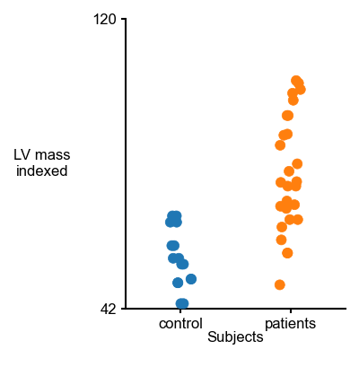
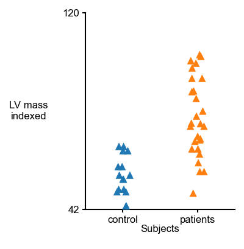
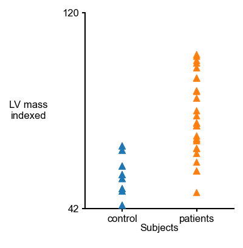
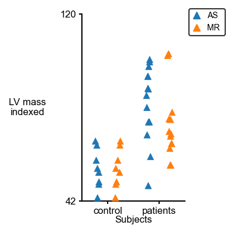
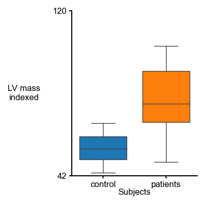
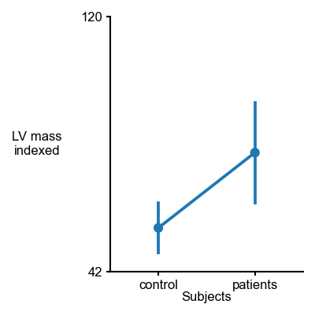
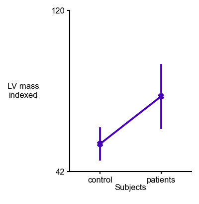
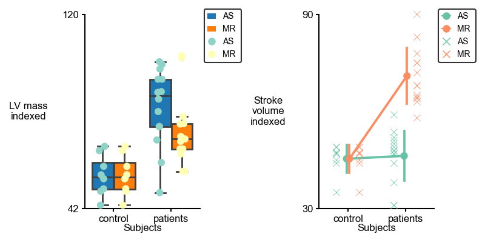

# Multipanel Categorical


## Examples
- First import the `multi_panel_cat` function from the `PyCMLutil` library.
````python
>>> from PyCMLutil.plots.multi_panel_cat import multi_panel_cat_from_flat_data as mplc
````
## Note
Following examples are based on the data spreadsheet stored in the github [repository](https://github.com/Campbell-Muscle-Lab/PyCMLutilities): `<github_repo>/demos/data`.
**Template** files are also stored in the github [repository](https://github.com/Campbell-Muscle-Lab/PyCMLutilities): `<github_repo>/demos/templates`
- Then assign the path to the data spread sheet that you want to read data from.
````python
>>> data_path = `data/valvular_disease.xlsx`
````

**Example 1:** 1 by 1  multipanel [stripplot](https://seaborn.pydata.org/generated/seaborn.stripplot.html#seaborn.stripplot).
```` python
>>> template_path = `demos/templates/1X1_strip_valvular.json`
>>> output_image_path = `<path_to>/1X1_strip_valvular.png/`
>>> mplc(data_file_string = data_path,
... template_file_string = template_path, 
... output_image_file_string= output_image_path)
````


**Example 2:** 1 by 1  multipanel [stripplot](https://seaborn.pydata.org/generated/seaborn.stripplot.html#seaborn.stripplot) with modified markers shape.
```` python

>>> template_path = `templates/1X1_strip_hue_valvular_markers.json`
>>> output_image_path = `<path_to>/1X1_strip_valvular_markers.png/`
>>> mplc(data_file_string = data_path,
... template_file_string = template_path,
... output_image_file_string= output_image_path)
````


**Example 3:** 1 by 1  multipanel [stripplot](https://seaborn.pydata.org/generated/seaborn.stripplot.html#seaborn.stripplot) with no jitter.
```` python

>>> template_path = `templates/1X1_strip_hue_valvular_no_jitter.json`
>>> output_image_path = `<path_to>/1X1_strip_hue_valvular_no_jitter.png/`
>>> mplc(data_file_string = data_path,
... template_file_string = template_path,
... output_image_file_string= output_image_path)
````


**Example 4:** 1 by 1  multipanel [stripplot](https://seaborn.pydata.org/generated/seaborn.stripplot.html#seaborn.stripplot) with hue.
```` python
>>> template_path = `templates/1X1_strip_valvular_hue.json`
>>> output_image_path = `<path_to>/1X1_strip_valvular_hue.png/`
>>> mplc(data_file_string = data_path,
... template_file_string = template_path,
... output_image_file_string= output_image_path)
````


**Example 5:** 1 by 1  multipanel [boxplot](https://seaborn.pydata.org/generated/seaborn.pointplot.html#seaborn.boxplot).
```` python
>>> template_path = `templates/1X1_box_valvular.json`
>>> output_image_path = `<path_to>/1X1_box_valvular.png/`
>>> mplc(data_file_string = data_path,
... template_file_string = template_path,
... output_image_file_string= output_image_path)
````


**Example 6:** 1 by 1  multipanel [boxplot](https://seaborn.pydata.org/generated/seaborn.pointplot.html#seaborn.boxplot) with hue.
```` python
>>> template_path = `templates/1X1_box_valvular_hue.json`
>>> output_image_path = `<path_to>/1X1_box_valvular_hue.png/`
>>> mplc(data_file_string = data_path,
... template_file_string = template_path,
... output_image_file_string= output_image_path)
````


**Example 7:** 1 by 1  multipanel [boxplot](https://seaborn.pydata.org/generated/seaborn.pointplot.html#seaborn.boxplot) with modified line width and box palette.
```` python
>>> template_path = `templates/1X1_box_valvular_modified_style.json`
>>> output_image_path = `<path_to>/1X1_box_valvular_modified_style.png/`
>>> mplc(data_file_string = data_path,
... template_file_string = template_path,
... output_image_file_string= output_image_path)
````


Now let's try another type of plot for categorical data.

**Example 8:** 1 by 1  multipanel [pointplot](https://seaborn.pydata.org/generated/seaborn.pointplot.html#seaborn.pointplot).
```` python
>>> template_path = `templates/1X1_point_valvular.json`
>>> output_image_path = `<path_to>/1X1_point_valvular.png/`
>>> mplc(data_file_string = data_path,
... template_file_string = template_path,
... output_image_file_string= output_image_path)
````


**Example 9:** 1 by 1  multipanel [pointplot](https://seaborn.pydata.org/generated/seaborn.pointplot.html#seaborn.pointplot) with modified marker shape and new palette.
```` python
>>> template_path = `templates/1X1_point_valvular_markers.json`
>>> output_image_path = `<path_to>/1X1_point_valvular_markers.png/`
>>> mplc(data_file_string = data_path,
... template_file_string = template_path,
... output_image_file_string= output_image_path)
````


**Example 10:** 1 by 1  multipanel [pointplot](https://seaborn.pydata.org/generated/seaborn.pointplot.html#seaborn.pointplot) with hue.
```` python
>>> template_path = `templates/1X1_point_valvular_hue.json`
>>> output_image_path = `<path_to>/1X1_point_valvular_hue.png/`
>>> mplc(data_file_string = data_path,
... template_file_string = template_path,
... output_image_file_string = output_image_path)
````


Now let's combine the categorical plotting functions and make multipanel plots. 

**Example 11:** 1 by 1  multipanel [boxplot](https://seaborn.pydata.org/generated/seaborn.pointplot.html#seaborn.boxplot) along [stripplot](https://seaborn.pydata.org/generated/seaborn.stripplot.html#seaborn.stripplot) together with hue.
```` python
>>> template_path = `templates/1X1_box_strip_valvular.json`
>>> output_image_path = `<path_to>/1X1_box_strip_valvular.png/`
>>> mplc(data_file_string = data_path,
... template_file_string = template_path,
... output_image_file_string = output_image_path)
````


**Example 12:** 1 by 2  multipanel plots in shapes of [boxplot](https://seaborn.pydata.org/generated/seaborn.pointplot.html#seaborn.boxplot) and [pointplot](https://seaborn.pydata.org/generated/seaborn.pointplot.html#seaborn.pointplot) with raw data shown with [stripplot](https://seaborn.pydata.org/generated/seaborn.stripplot.html#seaborn.stripplot).
```` python
>>> template_path = `templates/1X2_box_point_strip_valvular.json`
>>> output_image_path = `<path_to>/1X2_box_point_strip_valvular.png/`
>>> mplc(data_file_string = data_path,
... template_file_string = template_path,
... output_image_file_string = output_image_path)
````


**Example 8:** 2 by 2  multipanel plots with different type of plots.
```` python
>>> template_path = `templates/4X4_multiple_valvular.json`
>>> output_image_path = `<path_to>/4X4_multiple_valvular.png/`
>>> mplc(data_file_string = data_path,
... template_file_string = template_path,
... output_image_file_string = output_image_path)
````


